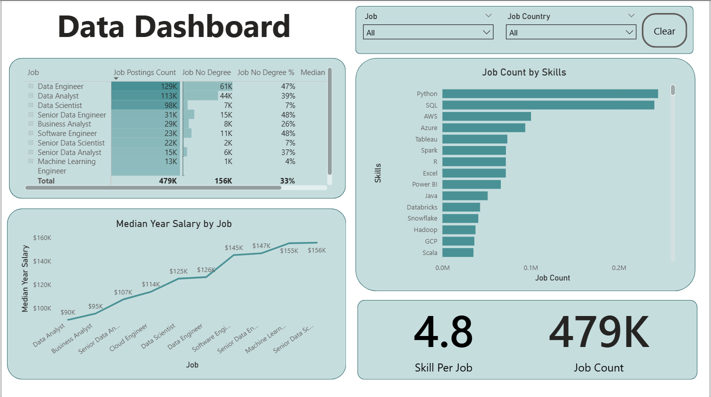

# 📊 Data Jobs Dashboard with Power BI

---

## Introduction

This project is an interactive **Power BI dashboard** created to analyze the **data job market** using real-world job postings data.

The dashboard is designed for aspiring data professionals, career switchers, and analysts who want to better understand job demand, required skills, degree requirements, and salary levels across different data roles.  
It provides a clear, high-level overview of the data job market and supports data-driven career decisions.

---

## Business Use Case

This dashboard helps users answer key questions related to career planning and job market analysis:

- Which data roles are most in demand?
- How salaries differ by role and seniority
- What skills are most frequently required across data positions
- How often a formal degree is required for data jobs
- How job demand varies by country

The insights can be used for:
- Career planning and role selection  
- Identifying high-value technical skills  
- Salary benchmarking  
- Improving job search strategy  

---

## Skills Showcased

This project demonstrates both technical Power BI skills and analytical thinking.

### ⚙️ Data Transformation (ETL)
- Cleaned and transformed raw job postings data using **Power Query**
- Handled missing values and inconsistent formats
- Created calculated and derived columns for analysis

### 🧮 Measures & KPIs
- Created DAX measures, including:
  - **Job Count**
  - **Median Yearly Salary**
  - **Skill per Job**
  - **No Degree Job Percentage**

### 📊 Data Visualization
- Bar charts for job demand and skills analysis
- Line charts for salary comparison across roles
- Tables for detailed job breakdowns
- KPI cards for high-level metrics

### 🎨 Dashboard Design
- Clean and consistent layout
- Clear visual hierarchy for easier interpretation
- Focus on readability and business storytelling

### 🖱️ Interactivity
- Slicers for filtering by **Job Title** and **Country**
- Interactive visuals that update dynamically based on filters
- Clear button to reset selections

---

## Dashboard Overview

### High-Level Market View

This page provides a summary of the data job market:

- Total number of job postings
- Average number of skills required per job
- Job demand by role
- Median salary comparison across data roles
- Most in-demand technical skills
- Share of jobs that do not require a formal degree

---

## Key Insights

- **Data Engineer** and **Data Analyst** roles have the highest job demand.
- Senior roles offer significantly higher salaries but fewer job openings.
- Jobs requiring a broader technical skill set tend to offer higher median salaries.
- A large share of data jobs do **not** strictly require a formal degree, indicating a skills-first hiring trend.
- Python and SQL are the most in-demand skills across data roles.

---

## Conclusion

This project demonstrates how **Power BI** can be used to transform raw job postings data into meaningful career insights.

It highlights my ability to:
- Work with real-world, imperfect datasets
- Build meaningful KPIs and analytical measures
- Design clean, business-focused dashboards
- Communicate insights clearly through data visualization

---

## Tools & Technologies

- **Power BI**
- **Power Query**
- **DAX**
- Data Visualization & Dashboard Design

